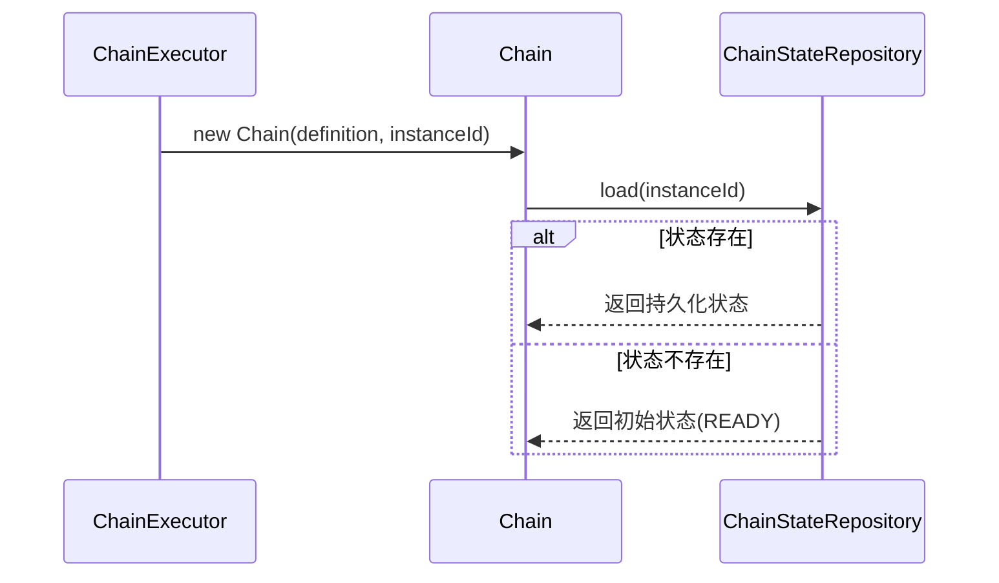

# Chain State Repository 开发设计文档

<div v-pre>


## 1. 概述

`ChainStateRepository` 是 Tinyflow AI 工作流编排框架中负责**持久化与加载 `ChainState`** 的核心存储抽象。它为工作流引擎提供了**状态隔离、并发安全、可扩展存储**的能力，是实现**可恢复执行、分布式调度、持久化快照**等功能的基础设施。

本文档详细阐述 `ChainStateRepository` 的**接口契约、实现机制、扩展模型与最佳实践**，帮助开发者构建高可靠、高性能的工作流状态存储层。


## 2. 接口设计

### 2.1 核心接口定义

```java
public interface ChainStateRepository {
    /**
     * 根据实例 ID 加载 ChainState
     * @param instanceId 工作流实例唯一标识
     * @return ChainState 实例，若不存在应创建初始状态
     */
    ChainState load(String instanceId);

    /**
     * 尝试更新 ChainState（乐观锁更新）
     * @param newState 要更新的状态对象（包含新 version）
     * @param fields 要更新的字段集合（用于字段级更新优化）
     * @return true 表示更新成功（版本匹配），false 表示冲突
     */
    boolean tryUpdate(ChainState newState, EnumSet<ChainStateField> fields);
}
```

### 2.2 设计原则

- **按需加载**：`load()` 在状态不存在时应返回初始状态（`ChainStatus.READY`）
- **乐观并发控制**：`tryUpdate()` 必须实现版本号（`version`）校验
- **字段级更新**：`fields` 参数允许存储层仅持久化变更字段，提升性能
- **无异常契约**：接口方法不应抛出检查异常，失败时返回 `false` 或 `null`


## 3. 默认实现：`InMemoryChainStateRepository`

### 3.1 实现机制

```java
public class InMemoryChainStateRepository implements ChainStateRepository {
    private static final Map<String, ChainState> chainStateMap = new ConcurrentHashMap<>();

    @Override
    public ChainState load(String instanceId) {
        return MapUtil.computeIfAbsent(chainStateMap, instanceId, k -> {
            ChainState state = new ChainState();
            state.setInstanceId(instanceId);
            return state;
        });
    }

    @Override
    public boolean tryUpdate(ChainState chainState, EnumSet<ChainStateField> fields) {
        chainStateMap.put(chainState.getInstanceId(), chainState);
        return true; // 内存实现无并发冲突
    }
}
```

### 3.2 特性分析

| 特性 | 说明                     |
|--|------------------------|
| **线程安全** | 基于 `ConcurrentHashMap` |
| **懒加载** | 首次访问时创建初始状态            |
| **无持久化** | JVM 重启后状态丢失            |
| **无版本校验** | 单机内存模型无并发更新冲突          |
| **适用场景** | 单机测试、演示、短期任务           |

> ⚠️ **限制**：**不适用于生产环境**，因状态无法跨进程共享，且 JVM 退出后丢失。


## 4. 扩展模型

### 4.1 自定义存储实现

开发者可通过实现 `ChainStateRepository` 接口集成任意存储系统：

#### 关键实现要点：

1. **版本号校验（CAS）**
   ```java
   // 伪代码：Redis 实现
   Long currentVersion = redis.hget(instanceId, "version");
   if (currentVersion != null && currentVersion != newState.getVersion() - 1) {
       return false; // 版本冲突
   }
   // 执行更新
   redis.hmset(instanceId, serialize(newState));
   return true;
   ```

2. **字段级更新优化**
   ```java
   // 仅更新指定字段，减少 I/O
   if (fields.contains(ChainStateField.MEMORY)) {
       redis.hset(instanceId, "memory", serialize(newState.getMemory()));
   }
   if (fields.contains(ChainStateField.STATUS)) {
       redis.hset(instanceId, "status", newState.getStatus().name());
   }
   ```

3. **初始状态处理**
   ```java
   // load() 方法中
   ChainState state = database.query(instanceId);
   if (state == null) {
       state = new ChainState();
       state.setInstanceId(instanceId);
   }
   return state;
   ```

### 4.2 推荐存储方案

| 存储类型 | 适用场景 | 实现建议 |
|-|-|-|
| **Redis** | 分布式、高并发、短期任务 | Hash 结构 + Lua 脚本保证 CAS 原子性 |
| **MySQL/PostgreSQL** | 长期归档、强一致性 | JSON 字段存储 `memory`，version 作为 CAS 条件 |
| **MongoDB** | 文档友好、灵活 schema | Document 存储，利用 `$inc` 更新 version |
| **File System** | 单机持久化、调试 | JSON 文件存储，文件锁保证并发安全 |


## 5. 与工作流引擎的集成

### 5.1 状态加载流程



### 5.2 状态更新流程

```mermaid
sequenceDiagram
    participant Chain
    participant ChainStateRepository
    
    loop 乐观锁重试(最多30秒)
        Chain->>ChainStateRepository: load(instanceId)
        Chain->>Chain: 修改状态 → version++
        Chain->>ChainStateRepository: tryUpdate(newState, fields)
        alt 更新成功
            ChainStateRepository-->>Chain: true
            break
        else 版本冲突
            ChainStateRepository-->>Chain: false
            Chain->>Chain: 等待退避后重试
        end
    end
```

> 🔁 **重试机制**：`Chain.updateStateSafely()` 负责重试逻辑，存储层只需返回 `true/false`


## 6. 最佳实践

### 6.1 生产环境存储选型

✅ **短期任务（<24h）**：Redis Hash + TTL 自动清理  
✅ **长期任务/审计需求**：关系型数据库（MySQL/PostgreSQL）  
✅ **高吞吐场景**：Redis Cluster 分片存储  
✅ **开发测试**：`InMemoryChainStateRepository`

### 6.2 性能优化

- **字段级更新**：利用 `fields` 参数减少序列化开销
- **批量操作**：对 `memory` 大对象进行压缩（如 GZIP）
- **缓存层**：在数据库前加 Redis 缓存，降低主存储压力
- **TTL 策略**：为终态（`isTerminal()`）实例设置自动过期

### 6.3 可靠性保障

- **原子性**：`tryUpdate` 必须保证 **version 校验 + 状态更新** 的原子性
- **幂等性**：`load()` 多次调用应返回相同状态


## 7. 自定义实现示例（Redis）

```java
public class RedisChainStateRepository implements ChainStateRepository {
    private final RedisTemplate<String, String> redis;

    @Override
    public ChainState load(String instanceId) {
        String json = redis.opsForValue().get("chain:state:" + instanceId);
        if (json == null) {
            ChainState state = new ChainState();
            state.setInstanceId(instanceId);
            return state;
        }
        return ChainState.fromJSON(json);
    }

    @Override
    public boolean tryUpdate(ChainState newState, EnumSet<ChainStateField> fields) {
        String key = "chain:state:" + newState.getInstanceId();
        String script = 
            "local current = redis.call('GET', KEYS[1])\n" +
            "if current then\n" +
            "  local version = cjson.decode(current).version\n" +
            "  if version ~= tonumber(ARGV[2]) - 1 then\n" +
            "    return 0\n" +
            "  end\n" +
            "end\n" +
            "redis.call('SET', KEYS[1], ARGV[1])\n" +
            "return 1";
        
        Long result = redis.execute(
            (RedisCallback<Long>) conn -> 
                conn.eval(script.getBytes(), 
                         new byte[][]{key.getBytes()}, 
                         new byte[][]{newState.toJSON().getBytes(), 
                                      String.valueOf(newState.getVersion()).getBytes()})
        );
        return result != null && result == 1;
    }
}
```


## 8. 总结

`ChainStateRepository` 是 Tinyflow 工作流引擎的**状态存储基石**，其简洁的接口设计与灵活的扩展模型，使得开发者能够根据业务需求选择合适的存储方案。无论是单机内存、分布式缓存还是持久化数据库，都能无缝集成，为 AI 工作流提供**可靠、高效、可扩展**的状态管理能力。


</div>
