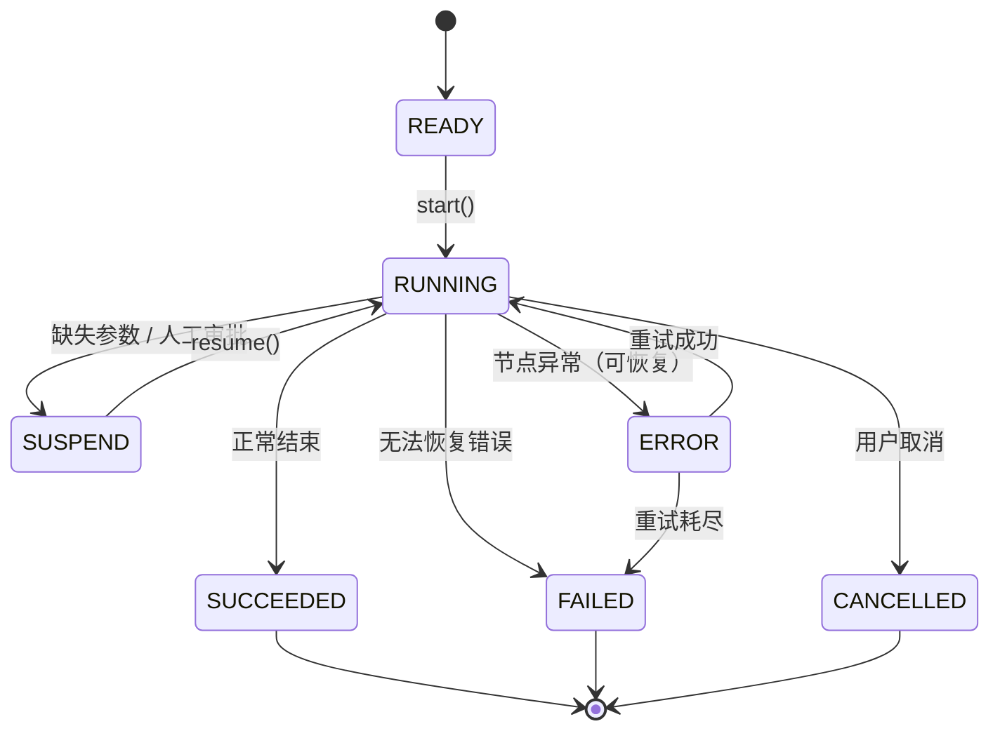

# Chain State 开发设计文档

<div v-pre>

## 1. 概述

`ChainState` 是 Tinyflow AI 工作流编排框架中的**核心运行时状态载体**，完整记录了单个工作流实例（`Chain`）的生命周期状态、执行上下文、内存变量、错误信息与挂起条件。它采用**无外部依赖、可序列化、线程安全**的设计，支撑了 Tinyflow 的**可恢复执行、状态持久化、分布式调度**等关键能力。

本文档深入解析 `ChainState` 的**数据模型、状态机设计、内存管理机制与扩展能力**，为开发者提供构建高可靠 AI 工作流系统的基础。


## 2. 核心设计原则

### 2.1 状态与行为分离

- `ChainState` **仅包含数据**，不包含业务逻辑
- 所有状态变更通过外部 `Chain` 或 `ChainExecutor` 调用 `updateStateSafely()` 完成
- **优势**：便于序列化、快照、审计与恢复

### 2.2 线程安全

- 使用 `ConcurrentHashMap` 作为内存存储
- 所有字段均为 `private` + `getter/setter`
- 状态更新通过**乐观锁**（`version` 字段）保证一致性

### 2.3 可序列化与可恢复

- 实现 `Serializable` 接口
- 提供 `toJSON()` / `fromJSON()` 支持 JSON 序列化（兼容 FastJSON）
- 支持 `reset()` 方法重置状态（用于测试或重试）

### 2.4 终态不可变

- 一旦进入 `SUCCEEDED` / `FAILED` / `CANCELLED`，状态不可再变更
- 通过 `isTerminal()` 方法判断是否为终态


## 3. 数据模型详解

### 3.1 核心字段

| 字段 | 类型 | 说明                                |
|--|--|-----------------------------------|
| `instanceId` | `String` | 唯一实例 ID（UUID），用于标识工作流实例           |
| `chainDefinitionId` | `String` | 关联的 `ChainDefinition` ID          |
| `memory` | `ConcurrentHashMap<String, Object>` | **全局内存区**，存储节点输出、中间变量             |
| `executeResult` | `Map<String, Object>` | 最近一次节点执行的直接输出                     |
| `environment` | `Map<String, Object>` | **环境变量**，用于模板插值（如 `{{env.user}}`） |
| `computeCost` | `long` | 算力消耗（积分），支持累加                     |
| `status` | `ChainStatus` | 当前生命周期状态                          |
| `error` | `ExceptionSummary` | 错误摘要（含堆栈、消息）                      |
| `version` | `long` | **乐观锁版本号**，用于 CAS 更新              |
| `suspendNodeIds` | `Set<String>` | 挂起的节点 ID 集合                       |
| `suspendForParameters` | `List<Parameter>` | 挂起时缺失的参数列表                        |

> 💡 **内存存储规则**：节点输出以 `nodeId.outputKey` 形式存入 `memory`，例如 `llmNode.response`


## 4. 状态机设计（`ChainStatus`）



### 状态分类

| 类别 | 状态 | 说明               |
|--|--|------------------|
| **初始态** | `READY` | 已创建，未启动          |
| **运行中** | `RUNNING` | 正在执行节点           |
|  | `SUSPEND` | **人工挂起**（需外部输入）  |
|  | `ERROR` | **系统错误**（可重试）    |
| **终态** | `SUCCEEDED` | 成功完成（不可变）        |
|  | `FAILED` | 失败结束（不可变）        |
|  | `CANCELLED` | 主动取消（不可变）        |


## 5. 内存与参数解析机制

### 5.1 双层变量作用域

`ChainState` 提供两层变量解析：

1. **`memory`**：动态执行结果（节点输出、中间变量）
2. **`environment`**：静态环境变量（启动参数、系统环境）

### 5.2 参数解析（`resolveParameters`）

`ChainState` 负责将 `Node` 的 `Parameter` 定义解析为实际值：

```java
// Parameter 定义示例
Parameter param = new Parameter("query", RefType.REF, "userInput");
```

**解析流程**：
1. **`FIXED`**：直接取 `value`，支持模板插值（`{{env.xxx}}`）
2. **`REF`**：从 `memory` 或 `environment` 按路径查找（如 `user.profile.name`）
3. **`INPUT`**（默认）：从 `memory` 按 `name` 查找

**类型转换**：
- `String` → `Boolean` / `Number` / `Array`（基于 `DataType`）

### 5.3 挂起触发（Suspend-on-Missing）

- 若 `Parameter.isRequired() == true` 且值为空
- 自动抛出 `ChainSuspendException`，携带缺失参数列表
- **不修改状态**，由上层 `Chain` 捕获并设置 `SUSPEND`


## 6. 序列化与持久化

### 6.1 JSON 序列化（FastJSON）

- 使用自定义 `ChainSerializer` / `ChainDeserializer`
- 支持嵌套序列化（如 `ChainState` 作为字段）
- 启用 `WriteClassName` 保证反序列化类型安全

```java
String json = chainState.toJSON();
ChainState restored = ChainState.fromJSON(json);
```

### 6.2 乐观锁（`version`）

- 每次 `tryUpdate` 成功后 `version++`
- `ChainStateRepository` 实现需校验 `version` 一致性
- 避免分布式环境下的**写冲突**

### 6.3 重置与克隆

- `reset()`：清空所有状态（用于测试）
- 无显式克隆方法，但可通过 `toJSON()` → `fromJSON()` 实现深拷贝


## 7. 扩展能力

### 7.1 算力计量（`computeCost`）

- 支持 `addComputeCost()` 累加算力消耗
- 可用于计费、配额控制、优先级调度

### 7.2 节点结果提取（`getNodeExecuteResult`）

```java
// 获取 llmNode 的所有输出
Map<String, Object> llmOutputs = chainState.getNodeExecuteResult("llmNode");
// 返回 { "response": "...", "tokens": 123 }
```

### 7.3 环境变量增强（`getEnvMap`）

- 自动注入 `env.sys`（系统环境变量）
- 支持模板中使用 `{{env.sys.HOME}}`


## 8. 最佳实践

✅ **避免直接操作 `memory`**：始终通过 `resolveParameters` 或 `updateStateSafely`  
✅ **合理使用 `environment`**：启动参数、配置项存入 `environment`，执行结果存入 `memory`  
✅ **终态检查**：操作前调用 `status.isTerminal()` 避免无效更新  
✅ **挂起参数设计**：`Parameter` 应包含清晰的 `description` 用于用户提示  
✅ **序列化兼容**：新增字段需考虑反序列化兼容性（提供默认值）


## 9. 性能与可靠性

| 机制 | 说明                            |
|--|-------------------------------|
| **ConcurrentHashMap** | 高并发读写安全                       |
| **字段级更新** | `updateStateSafely` 仅持久化变更字段  |
| **乐观锁** | 避免分布式写冲突                      |
| **终态保护** | 防止状态回滚或非法变更                   |
| **轻量序列化** | FastJSON 高性能，支持大对象            |

> 💡 **生产建议**：
> - 使用 Redis Hash 存储 `ChainState`，`version` 作为 CAS 条件
> - 对 `memory` 设置 TTL 或大小限制，防内存爆炸
> - 定期归档终态 `ChainState`，降低存储压力


## 10. 总结

`ChainState` 是 Tinyflow 工作流引擎的**状态基石**，通过清晰的数据模型、严谨的状态机、安全的内存管理与灵活的扩展机制，为 AI 应用提供了**可观察、可恢复、可计量**的运行时保障。开发者可基于其设计，构建从简单自动化到复杂智能体协作的可靠系统。


</div>
