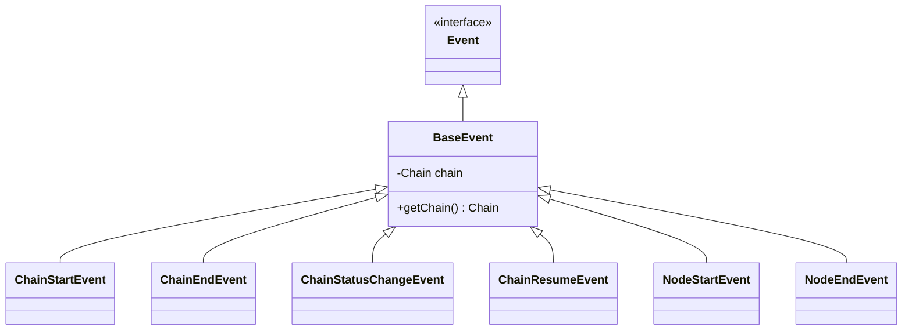

# Chain Listener 监听器开发设计文档

<div v-pre>


## 1. 概述

Tinyflow 工作流引擎采用**事件驱动架构（Event-Driven Architecture）**，通过 `EventManager` 和一系列监听器接口，为开发者提供全流程的**可观测性、可扩展性与可集成性**。监听器机制覆盖工作流生命周期、节点执行、错误处理、输出拦截等关键环节，是构建企业级 AI 应用的核心扩展点。

本文档详细阐述 Tinyflow 监听器体系的**事件模型、监听器类型、使用方式与最佳实践**，帮助开发者实现监控告警、审计日志、外部系统集成等高级功能。


## 2. 事件模型设计

### 2.1 事件基类体系



- **`Event`**：所有事件的标记接口
- **`BaseEvent`**：包含关联的 `Chain` 实例
- **具体事件类**：携带特定上下文数据（如变量、状态、错误等）

### 2.2 事件发布时机

| 事件类型 | 触发时机 | 关键数据 |
|-|-|-|
| `ChainStartEvent` | 工作流启动时 | 初始变量 (`variables`) |
| `ChainStatusChangeEvent` | 状态变更时 | 新状态、旧状态 |
| `ChainResumeEvent` | 挂起恢复时 | 恢复变量 (`variables`) |
| `ChainEndEvent` | 工作流终态时 | - |
| `NodeStartEvent` | 节点执行前 | 节点实例 |
| `NodeEndEvent` | 节点执行后 | 节点、结果、错误 |


## 3. 监听器类型详解

### 3.1 `ChainEventListener`

#### 接口定义
```java
void onEvent(Event event, Chain chain);
```

#### 注册方式
```java
// 监听特定事件
eventManager.addEventListener(ChainStartEvent.class, (event, chain) -> {
    log.info("Chain started: {}", chain.getStateInstanceId());
});

// 监听所有事件
eventManager.addEventListener((event, chain) -> {
    log.debug("Event: {} for chain {}", event.getClass().getSimpleName(), chain.getStateInstanceId());
});
```

#### 适用场景
- 全局日志记录
- 指标埋点（Prometheus）
- 自定义事件总线（Kafka/RabbitMQ）


### 3.2 `ChainOutputListener`

#### 接口定义
```java
void onOutput(Chain chain, Node node, Object outputMessage);
```

#### 触发时机
- 节点调用 `chain.output(node, response)` 时
- **注意**：非所有节点都会触发（需显式调用 `output()`）

#### 适用场景
- 结果存档（审计日志）
- 实时推送（SSE/WebSocket/邮件）


### 3.3 `ChainErrorListener`

#### 接口定义
```java
void onError(Throwable error, Chain chain);
```

#### 触发时机
- 工作流进入 `FAILED` 状态时
- **不包括**：节点重试中的临时错误（`NodeErrorListener` 处理）

#### 适用场景
- 企业微信/钉钉告警
- 错误分类统计
- 自动补偿流程触发


### 3.4 `NodeErrorListener`

#### 接口定义
```java
void onError(Throwable error, Node node, Map<String, Object> nodeResult, Chain chain);
```

#### 触发时机
- 节点执行抛出异常时（无论是否重试）

#### 适用场景
- 节点级错误分析
- 重试策略优化
- 临时结果保存（用于调试）


## 4. 使用方式

### 4.1 通过 ChainExecutor 注册（推荐）

```java
ChainExecutor executor = new ChainExecutor(...);

// 监听工作流启动
executor.addEventListener(ChainStartEvent.class, (event, chain) -> {
    auditLog.info("Started chain {} with variables: {}", 
        chain.getStateInstanceId(), event.getVariables());
});

// 注册错误告警
executor.addErrorListener((error, chain) -> {
    alertService.send("Chain failed: " + chain.getStateInstanceId(), error);
});

// 注册输出拦截
executor.addOutputListener((chain, node, output) -> {
    if (node instanceof LlmNode) {
        contentFilter.scan(output); // 内容安全检测
    }
});
```

### 4.2 直接操作 EventManager

```java
EventManager eventManager = chain.getEventManager();

eventManager.addChainErrorListener((error, chain) -> {
    // 错误处理逻辑
});

// 取消监听
eventManager.removeChainErrorListener(listener);
```


## 5. 线程与异常安全

### 5.1 线程安全设计

| 组件                    | 线程安全机制 |
|-----------------------|--|
| `eventListeners`      | `ConcurrentHashMap` + `synchronizedList` |
| `outputListeners`     | `Collections.synchronizedList` |
| `chainErrorListeners` | `Collections.synchronizedList` |
| `nodeErrorListeners`  | `Collections.synchronizedList` |

> ✅ 所有注册/注销/通知操作均为线程安全

### 5.2 异常隔离

- 监听器内部异常**不会中断**工作流执行
- 异常被 `EventManager` 捕获并记录日志
- **设计原则**：监听器故障不应影响主流程

```java
try {
    listener.onEvent(event, chain);
} catch (Exception e) {
    log.error("Error in event listener: {}", e.toString(), e);
}
```


## 6. 最佳实践

### 6.1 监听器职责分离

| 监听器类型 | 职责      | 反模式 |
|-|---------|--|
| `ChainEventListener` | 通用事件处理  | 在其中实现业务逻辑 |
| `ChainOutputListener` | 输出处理    | 修改输出内容 |
| `ChainErrorListener` | 全局错误处理  | 重试失败链 |
| `NodeErrorListener` | 节点级错误分析 | 抛出新异常 |

### 6.2 性能敏感操作

- **避免阻塞**：监听器中不应有耗时操作（如 HTTP 调用）
- **异步处理**：使用线程池或消息队列
  ```java
  executor.addErrorListener((error, chain) -> {
      asyncExecutor.submit(() -> alertService.send(chain, error));
  });
  ```

### 6.3 资源管理

- **避免内存泄漏**：动态注册的监听器应在适当时机注销
  ```java
  // 临时监听（如 ChainExecutor.execute()）
  try {
      executor.addEventListener(listener);
      chain.execute();
  } finally {
      executor.removeEventListener(listener);
  }
  ```


## 7. 高级应用场景

### 7.1 分布式追踪（OpenTelemetry）

```java
eventManager.addEventListener(ChainStartEvent.class, (event, chain) -> {
    Span span = tracer.spanBuilder("chain.execute")
        .setAttribute("chain.id", chain.getStateInstanceId())
        .startSpan();
    chain.getState().getMemory().put("otel.span", span);
});

eventManager.addEventListener(ChainEndEvent.class, (event, chain) -> {
    Span span = (Span) chain.getState().getMemory().get("otel.span");
    if (span != null) span.end();
});
```

### 7.2 成本计量

```java
eventManager.addOutputListener((chain, node, output) -> {
    if (node instanceof LlmNode) {
        long tokens = calculateTokens(output);
        chain.getState().addComputeCost(tokens);
    }
});
```

### 7.3 自动化测试

```java
@Test
public void testChainExecution() {
    List<NodeEndEvent> events = new CopyOnWriteArrayList<>();
    
    executor.addEventListener(NodeEndEvent.class, events::add);
    executor.execute("test-chain", Map.of("input", "test"));
    
    assertThat(events).hasSize(2);
    assertThat(events.get(1).getResult()).containsKey("output");
}
```


## 8. 事件类型参考表

| 事件类 | 触发方法 | 关键字段 | 典型用途 |
|--|-|-|-|
| `ChainStartEvent` | `Chain.start()` | `variables` | 初始化日志 |
| `ChainStatusChangeEvent` | `Chain.setStatusAndNotifyEvent()` | `status`, `before` | 状态机监控 |
| `ChainResumeEvent` | `Chain.resume()` | `variables` | 恢复审计 |
| `ChainEndEvent` | `Chain.handleNodeResult()` | - | 终态清理 |
| `NodeStartEvent` | `Chain.executeNode()` | `node` | 节点耗时开始 |
| `NodeEndEvent` | `Chain.handleNodeResult()` | `node`, `result`, `error` | 节点耗时结束、结果处理 |


## 9. 总结

Tinyflow 的监听器体系通过**分层事件模型**与**专用监听器接口**，为工作流引擎提供了强大的扩展能力。开发者可基于此构建从基础监控到复杂集成的各类企业级功能，同时保持主流程的简洁与稳定。

> **核心设计哲学**：  
> _"监听器是观察者，而非参与者" —— 它们感知流程，但不改变流程。_


</div>
