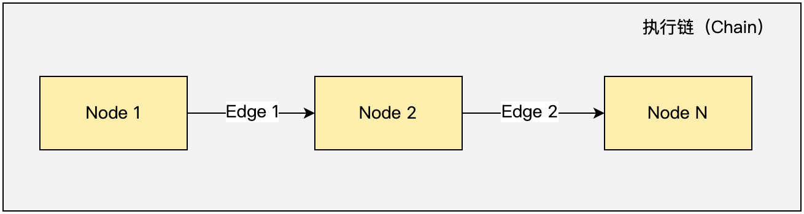

# 执行链（Chain）

执行链（Chain）是由 1 个或多个节点（Node）组成，每个节点（Node）之间通过 “边”（Edge） 链接起来。如下图所示：



在 Chain 执行链中，一般情况下是由第一个 Node 执行，执行的结果交给第二个 Node 继续协作，之后再交给第三个 Node，以此类推，最终得到我们需要的结果。


## 世界感知

执行链（Chain）在执行的过程中，会在不同的阶段，发出执行的事件通知，另外每个 Node 在执行的过程中，也可能会发布自己的自定义事件。

每个 Node 都可以感知到它所处的 Chain 的执行变化，以及它所处的 Chain 中的其他 Node 的执行变化，通过这种方式赋予 Node 感知世界的能力。

在 Chain 的外部，开发者可以为 Chain 配置自定义的 Event Listener 来感知 Chain 以及 Chain 中的 Node 的执行变化。


**示例代码**

 ```java 6-11
 String jsonString = "{....}"
 Tinyflow tinyflow = new Tinyflow(jsonString);

Chain chain = tinyflow.toChain();

chain.addEventListener(new ChainEventListener() {
    @Override
    public void onEvent(ChainEvent event, Chain chain) {
        System.out.println("event: " + event.toString());
    }
});
```

## 执行输出

执行链（Chain）在执行的过程中，可能会输出一些内容，给到客户端，告知执行的结果。

**示例代码**

 ```java 6-11
 String jsonString = "{....}"
 Tinyflow tinyflow = new Tinyflow(jsonString);

Chain chain = tinyflow.toChain();

chain.addOutputListener(new ChainOutputListener() {
    @Override
    public void onOutput(Chain chain, ChainNode node, Object message) {
        System.out.println("outputMessage: " + message);
    }
});
```

## 执行结果

在执行链（Chain）执行过程中，当执行完毕时，会返回一个结果，这个结果就是整个 Chain 的执行结果。

**示例代码**

 ```java 7
 String jsonString = "{....}"
 Tinyflow tinyflow = new Tinyflow(jsonString);

Chain chain = tinyflow.toChain();

// 获得执行结果
Map<String, Object> result = chain.executeForResult(variables);
```

## 执行异常

在执行链（Chain）执行过程中，如果某个 Node 执行过程中发生异常，会抛出异常，这个异常就是整个 Chain 的执行异常。
