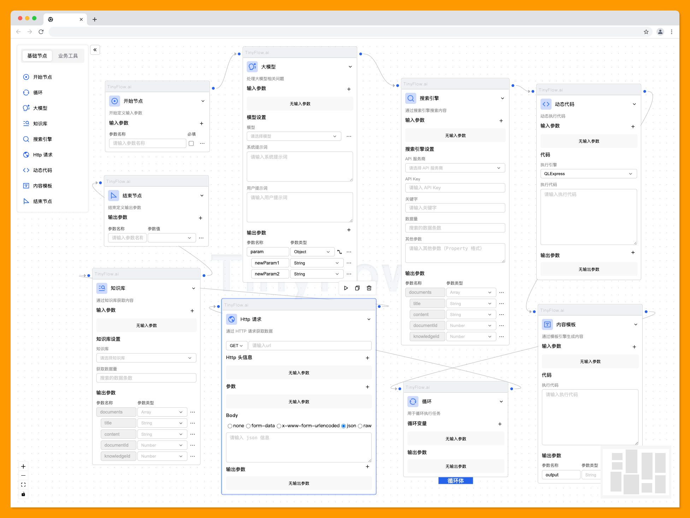

---
# https://vitepress.dev/reference/default-theme-home-page
layout: home

hero:
  name: "Tinyflow"
  text: "AI 工作流编排框架"
  tagline: 支持与 VUE、React 以及原生 JS 项目集成
  image:
    src: /assets/images/logo.png
    alt: Tinyflow
  actions:
    - theme: brand
      text: 快速开始
      link: /zh/quick-start
    - theme: alt
      text: 开发文档
      link: /zh/what-is-tinyflow

features:
  - title: 轻量，但功能强大
    details: Tinyflow 不追求大而全，而是专注于解决核心问题 —— 让 AI 工作流与现有业务无缝结合。它的代码库非常轻量，学习成本低，但功能却一点也不含糊。无论是简单的任务编排还是复杂的多模态推理，Tinyflow 都能轻松应对。
  - title: 极高的自由度 
    details: Tinyflow 基于 Web Component，她不会强迫你改变现有的技术栈，也不会对你的开发习惯指手画脚。无论你是前端开发者，还是后端工程师，都可以在自己的领域里找到最适合的切入点。我希望这种 “不打扰” 的设计哲学，能够让开发者觉得很舒心。
  - title: 面向未来的设计
    details: Tinyflow 的架构是模块化的，这意味着它可以随着你的业务需求不断扩展。比如，今天你只需要一个简单的文本生成流程，明天可能需要加入语音识别或图像处理。Tinyflow 的插件机制可以让你随时添加新功能，而不需要推倒重来。
---

