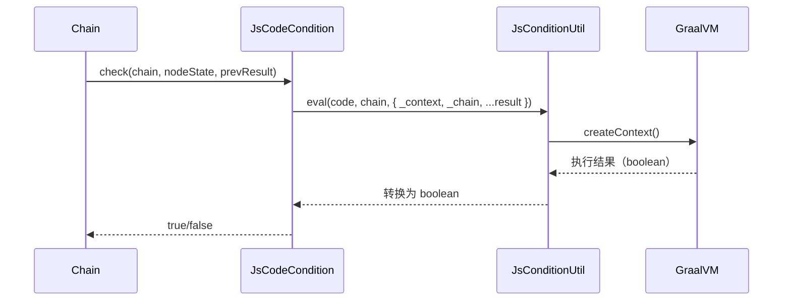

# Condition 开发设计文档

<div v-pre>

## 1. 概述

在 Tinyflow AI 工作流引擎中，**Condition（条件）** 是实现**动态流程控制**的核心机制。它决定了工作流在运行时是否执行某个节点（`NodeCondition`）或是否通过某条边（`EdgeCondition`），从而支持**条件跳过、分支路由、循环终止**等高级场景。

Tinyflow 采用 **GraalVM Polyglot** 作为条件表达式的执行引擎，通过 `JsConditionUtil` 提供高性能、安全的 JavaScript 脚本能力，同时支持自定义 Condition 扩展。

本文档详细阐述 Condition 的**类型体系、执行模型、GraalVM 集成、内置实现与扩展机制**，帮助开发者构建智能、灵活、安全的工作流决策逻辑。


## 2. Condition 类型体系

Tinyflow 定义了两种 Condition 接口，分别用于不同场景：

### 2.1 NodeCondition（节点条件）

```java
boolean check(Chain chain, NodeState context, Map<String, Object> executeResult);
```

- **作用时机**：节点执行**前**
- **核心用途**：决定是否**跳过**该节点
- **典型场景**：
    - 条件性执行（如“仅 VIP 用户执行优惠计算”）
    - 循环终止条件（`loopBreakCondition`）
    - 重试前置检查

### 2.2 EdgeCondition（边条件）

```java
boolean check(Chain chain, Edge edge, Map<String, Object> executeResult);
```

- **作用时机**：上游节点执行**后**，下游节点调度**前**
- **核心用途**：决定是否**通过该边**走向下游节点
- **典型场景**：
    - 分支路由（如“情感分析为正面则发送感谢邮件”）
    - 多路并行（多个条件同时满足）
    - 错误处理路径（“失败时走向补偿节点”）

> 💡 **关键区别**：
> - `NodeCondition` → **跳过节点**
> - `EdgeCondition` → **选择路径**


## 3. GraalVM 执行引擎：`JsConditionUtil`

### 3.1 核心设计

`JsConditionUtil` 基于 **GraalVM Polyglot** 实现 JavaScript 表达式执行：

```java
private static final Context.Builder CONTEXT_BUILDER = Context.newBuilder("js")
    .option("engine.WarnInterpreterOnly", "false")
    .allowHostAccess(HostAccess.ALL)          // 允许访问 Java 对象
    .allowHostClassLookup(className -> false) // 禁止动态加载类（安全）
    .option("js.ecmascript-version", "2021"); // 支持现代 JS 语法
```

### 3.2 安全机制

| 机制 | 说明                  | 安全价值 |
|-|---------------------|-|
| **`allowHostAccess(HostAccess.ALL)`** | 允许调用 Java 对象方法      | 支持 `chain.getState().getMemory()` |
| **`allowHostClassLookup(false)`** | **禁止**动态加载任意 Java 类 | 防止沙箱逃逸（如 `java.lang.Runtime`） |
| **`Context` 隔离** | 每次执行新建 `Context`    | 防止脚本间状态污染 |
| **异常包装** | 捕获并包装所有异常           | 避免脚本错误中断主流程 |


## 4. 内置实现：`JsCodeCondition`

`JsCodeCondition` 是 Tinyflow 的**统一脚本化条件实现**，同时支持 `NodeCondition` 和 `EdgeCondition`。

### 4.1 执行流程

```java
public boolean check(Chain chain, Edge edge, Map<String, Object> executeResult) {
    Maps map = Maps.of("_edge", edge).set("_chain", chain);
    if (executeResult != null) {
        map.putAll(executeResult); // 注入 result
    }
    return JsConditionUtil.eval(code, chain, map); // 执行脚本
}
```

### 4.2 表达式示例

#### 基础用法
```javascript
// 直接访问去前缀变量
response === "approved"

// 访问完整上下文
_chain.getState().getMemory().get("user.role") === "admin"

// 访问边信息
_edge.getId() === "approval-edge"
```

#### 高级特性
```javascript
// 空值安全（GraalVM 支持可选链）
result?.user?.profile?.age >= 18

// 类型转换
Number(result.score) > 0.8

// 逻辑组合
result.sentiment === "positive" && _chain.env.get("region") === "CN"
```

### 4.3 数据类型转换

`JsConditionUtil` 提供智能类型转换：

| Java 类型 | JS 布尔值规则             | JS 数值规则 |
|--|----------------------|-|
| `null` | `false`              | `0` |
| `Boolean` | 原值                   | `true→1, false→0` |
| `Number` | `!=0`                | 原值 |
| `String` | 非空且非 `"0"`/`"false"` | 解析为数字 |
| `Value`（GraalVM） | 按 JS 类型转换            | 按 JS 类型转换 |

> ✅ **兼容性**：支持 `"1"`, `"true"`, `1`, `true` 等多种形式


## 5. 执行模型

### 5.1 NodeCondition 执行流程



### 5.2 EdgeCondition 执行流程

（与 NodeCondition 类似，上下文变量不同）


## 6. 扩展机制

### 6.1 自定义 Condition 实现

#### 场景：基于外部服务的权限校验
```java
public class PermissionCondition implements NodeCondition {
    @Override
    public boolean check(Chain chain, NodeState context, Map<String, Object> result) {
        String userId = (String) chain.getState().resolveValue("user.id");
        // 调用外部服务（非脚本）
        return authService.hasPermission(userId, "SEND_EMAIL");
    }
}
```

#### 场景：混合条件（脚本+Java）
```java
public class HybridCondition implements EdgeCondition {
    private final String jsExpr;
    
    @Override
    public boolean check(Chain chain, Edge edge, Map<String, Object> result) {
        // 先执行 Java 逻辑
        if (!preCheck(chain, edge)) return false;
        
        // 再执行脚本
        Map<String, Object> extendedResult = new HashMap<>(result);
        extendedResult.put("preChecked", true);
        return JsConditionUtil.eval(jsExpr, chain, extendedResult);
    }
}
```

### 6.2 条件组合（Composite）
```java
public class OrCondition implements NodeCondition {
    private final List<NodeCondition> conditions;
    
    @Override
    public boolean check(Chain chain, NodeState context, Map<String, Object> result) {
        return conditions.stream().anyMatch(c -> c.check(chain, context, result));
    }
}
```


## 7. 高级特性

### 7.1 算力计量表达式

`JsConditionUtil.evalLong()` 用于动态计算算力消耗：
```java
// 基于 LLM 返回的 token 数
node.setComputeCostExpr("result.usage.total_tokens * 2");
```

### 7.2 条件缓存（性能优化）
```java
public class CachedJsCondition extends JsCodeCondition {
    private final Cache<String, Boolean> cache = Caffeine.newBuilder().build();
    
    @Override
    public boolean check(Chain chain, NodeState context, Map<String, Object> result) {
        String key = getCode() + ":" + result.hashCode();
        return cache.get(key, k -> super.check(chain, context, result));
    }
}
```

### 7.3 复杂数据结构支持

GraalVM 自动处理嵌套对象：
```javascript
// Java: result = { "user": { "profile": { "age": 25 } } }
// JS: result.user.profile.age === 25  // 直接访问
```


## 8. 总结

Condition 机制是 Tinyflow 工作流引擎的**智能决策核心**，通过 **GraalVM 高性能引擎**与**灵活的扩展模型**，实现了从简单跳过到复杂业务规则的全覆盖。其**安全沙箱**、**智能变量注入**、**类型转换**等特性，为开发者提供了强大而易用的动态流程控制能力。


</div>
