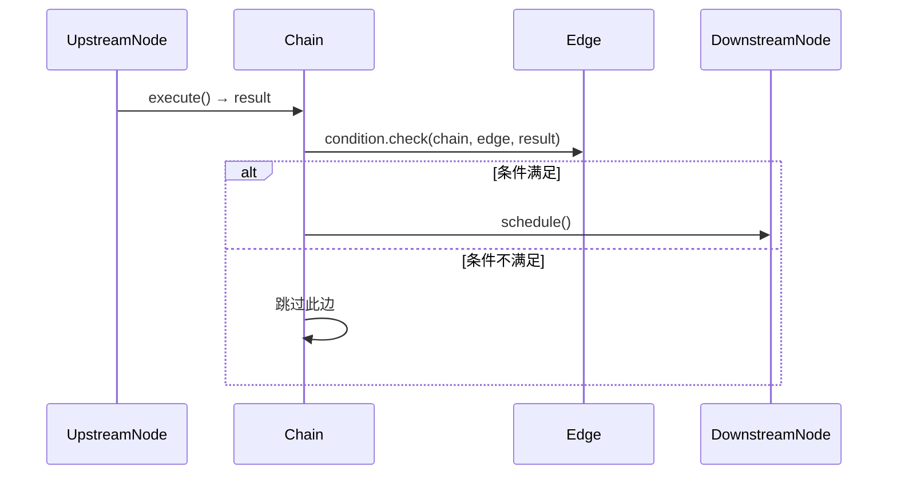

# Edge 开发设计文档

<div v-pre>


## 1. 概述

`Edge` 是 Tinyflow AI 工作流引擎中的**流程连接器**，用于定义节点之间的**拓扑关系与条件路由**。它作为工作流图（DAG）的边，不仅描述了数据流向，还通过条件表达式实现了**动态分支决策**，是构建复杂、智能工作流的关键组件。

本文档详细阐述 `Edge` 的**数据模型、条件机制、使用方式与最佳实践**，帮助开发者设计灵活、可维护的工作流路由逻辑。


## 2. 核心设计原则

### 2.1 轻量数据载体

- `Edge` 仅包含**连接信息**与**条件逻辑**，无业务行为
- **无状态**：不持有执行上下文，仅作为定义存在
- **序列化友好**：实现可持久化，支持 JSON/YAML 存储

### 2.2 条件驱动路由

- 通过 `EdgeCondition` 实现**动态分支**
- 条件基于**上游节点输出**与**全局状态**计算
- **默认无条件**：条件为 `null` 时始终通过

### 2.3 拓扑完整性

- `source` 与 `target` 严格对应 `Node.id`
- 与 `Node.inwardEdges` / `outwardEdges` 双向关联
- 保证工作流图的**一致性**与**可遍历性**


## 3. 数据模型详解

### 3.1 核心字段

| 字段 | 类型 | 说明                |
|--|--|-------------------|
| `id` | `String` | **唯一标识**（用于引用与调试） |
| `source` | `String` | **源节点 ID**（必须存在）  |
| `target` | `String` | **目标节点 ID**（必须存在） |
| `condition` | `EdgeCondition` | **路由条件**（可选）      |

### 3.2 关键约束

- **`source` ≠ `target`**：禁止自环（需通过 `Node.loopEnable` 实现循环）
- **ID 唯一性**：同一 `ChainDefinition` 中 `Edge.id` 必须唯一
- **节点存在性**：`source`/`target` 必须在 `nodes` 列表中


## 4. 条件机制（`EdgeCondition`）

### 4.1 接口定义

```java
@FunctionalInterface
public interface EdgeCondition {
    /**
     * 判断是否允许通过此边
     * @param chain 当前工作流上下文
     * @param edge 当前边实例
     * @param previousNodeResult 上游节点的执行结果
     * @return true 表示允许通过，false 表示跳过
     */
    boolean check(Chain chain, Edge edge, Map<String, Object> previousNodeResult);
}
```

### 4.2 条件执行时机

- **上游节点成功执行后**
- **调度下游节点前**
- **在 `Chain.scheduleOutwardNodes()` 中调用**

### 4.3 内置条件实现

Tinyflow 提供 `JsCodeCondition` 作为默认实现：

```java
// JSON 定义
{
  "data": {
    "condition": "result.score > 0.8"
  }
}

// 解析为
edge.setCondition(new JsCodeCondition("result.score > 0.8"));
```

- **表达式语法**：JavaScript（通过 `ScriptEngine` 执行）
- **上下文变量**：
    - `result`：上游节点输出（`previousNodeResult`）
    - `chain`：工作流实例（可访问 `chain.getState()`）


## 5. 使用方式

### 5.1 静态条件（代码构建）

```java
Edge edge = new Edge("edge-1");
edge.setSource("node-a");
edge.setTarget("node-b");
edge.setCondition((chain, edge, result) -> {
    return "approved".equals(result.get("status"));
});
chainDefinition.addEdge(edge);
```

### 5.2 动态条件（JSON 解析）

通过 `ChainParser` 解析 JSON：

```json
{
  "edges": [
    {
      "id": "e1",
      "source": "llm-node",
      "target": "send-email",
      "data": {
        "condition": "result.sentiment == 'positive'"
      }
    }
  ]
}
```

### 5.3 无条件边（默认行为）

```java
Edge edge = new Edge();
edge.setSource("start");
edge.setTarget("process"); // 始终执行
```


## 6. 与工作流引擎的集成

### 6.1 路由决策流程



### 6.2 多分支场景

一个节点可有多个出边，实现**多路分支**：

```java
// 节点 A 有三个出边
edge1.setCondition("result.type == 'email'");
edge2.setCondition("result.type == 'sms'");
edge3.setCondition("result.type == 'push'"); // 默认兜底
```

> ⚠️ **注意**：多个条件可能同时满足，导致**并行执行**

### 6.3 与节点条件的区别

| 特性       | `EdgeCondition` | `NodeCondition` |
|----------|--|--|
| **作用时机** | 节点执行**后** | 节点执行**前** |
| **依赖数据** | 上游节点输出 | 全局状态/历史输出 |
| **典型场景** | 分支路由 | 节点跳过 |
| **执行位置** | `scheduleOutwardNodes` | `shouldSkipNode` |


## 7 复杂场景处理

#### 场景 1：多条件组合
```javascript
// JSON 条件
"result.score > 0.8 && chain.env.get('region') == 'CN'"
```

#### 场景 2：空值安全
```javascript
// 安全访问嵌套属性
"result.user?.profile?.age > 18"
```

#### 场景 3：类型转换
```javascript
// 字符串转数字
"Number(result.count) > 10"
```


## 8. 高级扩展

### 8.1 自定义条件实现

```java
public class CustomEdgeCondition implements EdgeCondition {
    private final String requiredRole;
    
    public CustomEdgeCondition(String requiredRole) {
        this.requiredRole = requiredRole;
    }
    
    @Override
    public boolean check(Chain chain, Edge edge, Map<String, Object> result) {
        String userRole = (String) chain.getState().resolveValue("user.role");
        return requiredRole.equals(userRole);
    }
}

// 使用
edge.setCondition(new CustomEdgeCondition("admin"));
```

### 8.2 条件缓存（性能优化）

```java
public class CachedEdgeCondition implements EdgeCondition {
    private final EdgeCondition delegate;
    private final Cache<String, Boolean> cache = Caffeine.newBuilder()
        .maximumSize(1000)
        .build();
    
    @Override
    public boolean check(Chain chain, Edge edge, Map<String, Object> result) {
        String key = edge.getId() + ":" + result.hashCode();
        return cache.get(key, k -> delegate.check(chain, edge, result));
    }
}
```

### 8.3 条件验证

在 `ChainDefinition` 加载时校验条件语法：

```java
public class ValidatingChainParser extends ChainParser {
    @Override
    protected Edge parseEdge(JSONObject edgeObject) {
        Edge edge = super.parseEdge(edgeObject);
        if (edge.getCondition() instanceof JsCodeCondition) {
            JsCodeCondition cond = (JsCodeCondition) edge.getCondition();
            JsConditionUtil.validate(cond.getExpression()); // 预编译校验
        }
        return edge;
    }
}
```


## 9. 常见问题与解决方案

### 9.1 问题：条件始终不满足

**排查步骤**：
1. 检查上游节点输出结构（`result` 内容）
2. 在条件表达式中添加日志（`console.log(result)`）
3. 验证变量路径（如 `result.data.score` vs `result.score`）

### 9.2 问题：多分支同时触发

**解决方案**：
- 使用**互斥条件**：
  ```javascript
  // 分支1
  "result.type == 'A'"
  // 分支2
  "result.type == 'B'"
  // 分支3（兜底）
  "!(result.type == 'A' || result.type == 'B')"
  ```

### 9.3 问题：条件性能瓶颈

**优化方案**：
- 避免复杂计算（如正则、循环）
- 缓存条件结果（如上述 `CachedEdgeCondition`）
- 将条件逻辑移至上游节点（预计算标志位）


## 10. 总结

`Edge` 是 Tinyflow 工作流引擎的**智能路由中枢**，通过简洁的数据模型与灵活的条件机制，实现了从线性流程到复杂决策树的平滑演进。合理使用 `Edge` 条件，是构建**动态、自适应** AI 工作流的关键。

> **设计哲学**：  
> _"边决定流向，条件赋予智能"_


</div>
