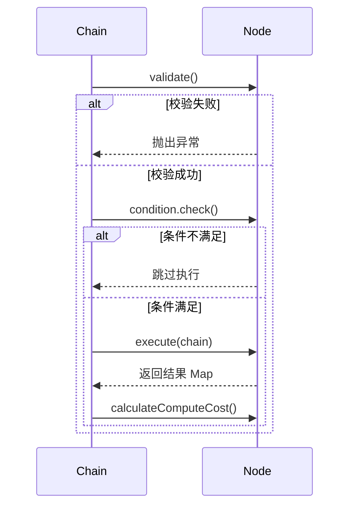

# Node 开发设计文档

<div v-pre>


## 1. 概述

`Node` 是 Tinyflow AI 工作流引擎中的**核心执行单元**，代表工作流中的一个处理步骤。每个 `Node` 封装了特定的业务逻辑（如调用大模型、发起 HTTP 请求、执行脚本等），并通过**输入参数、输出定义、执行策略**等机制，实现了**可配置、可重用、可监控**的工作流节点。

本文档深入解析 `Node` 的**抽象模型、执行机制、扩展能力与最佳实践**，帮助开发者构建高内聚、低耦合的工作流节点。


## 2. 核心设计原则

### 2.1 抽象与实现分离

- **`Node` 抽象类**：定义通用属性与生命周期
- **具体节点类**（如 `LlmNode`）：实现 `execute()` 方法
- **优势**：解耦核心框架与业务逻辑，便于扩展

### 2.2 配置驱动（Configuration-Driven）

- 节点行为由**参数**（`parameters`）、**条件**（`condition`）、**策略**（重试/循环）等配置决定
- **无需编码**即可调整节点行为（通过 JSON/YAML）

### 2.3 可观测性

- 内置**算力计量**（`computeCostExpr`）
- 支持**校验机制**（`NodeValidator`）
- 与**监听器体系**集成（`NodeStartEvent`/`NodeEndEvent`）

### 2.4 可恢复执行

- 支持**失败重试**（`retryEnable`）
- 支持**循环执行**（`loopEnable`）
- 支持**挂起等待**（通过 `ChainSuspendException`）


## 3. Node 抽象模型

### 3.1 核心属性

| 属性 | 类型 | 说明                       |
|--|-|--------------------------|
| `id` | `String` | **唯一标识**（用于拓扑引用）         |
| `name` | `String` | 人类可读名称                   |
| `description` | `String` | 详细描述                     |
| `inwardEdges` / `outwardEdges` | `List<Edge>` | **拓扑连接**（入边/出边）          |
| `condition` | `NodeCondition` | **执行前条件**（决定是否跳过）        |
| `validator` | `NodeValidator` | **启动前校验**（参数合法性等）        |
| `parameters` | `List<Parameter>` | **输入参数定义**（需子类实现 getter） |
| `outputDefs` | `List<Parameter>` | **输出定义**（需子类实现）          |

### 3.2 执行策略属性

| 属性 | 默认值 | 说明            |
|--|--|---------------|
| `retryEnable` | `false` | 是否启用失败重试      |
| `maxRetryCount` | `0` | 最大重试次数（0=无限）  |
| `retryIntervalMs` | `3000` | 重试间隔（毫秒）      |
| `resetRetryCountAfterNormal` | `false` | 成功后是否重置重试计数   |
| `loopEnable` | `false` | 是否启用循环执行      |
| `maxLoopCount` | `0` | 最大循环次数（0=无限）  |
| `loopIntervalMs` | `3000` | 循环间隔（毫秒）      |
| `loopBreakCondition` | `null` | 循环跳出条件        |

### 3.3 算力计量

- **`computeCostExpr`**：算力消耗表达式
    - 直接值：`"100"` → 固定消耗 100 积分
    - 表达式：`"{{output.tokens}}"` → 动态计算（基于执行结果）


## 4. 执行生命周期

### 4.1 执行流程



### 4.2 关键方法

#### `validate()`
- **时机**：节点执行前
- **用途**：校验配置合法性（如必填参数、API 密钥）
- **返回**：`NodeValidResult`（成功/失败 + 详情）

#### `execute(Chain chain)`
- **时机**：条件满足后
- **职责**：实现核心业务逻辑
- **返回**：`Map<String, Object>`（节点输出）
- **约束**：
    - 必须线程安全
    - 应处理异常（或抛出 `ChainSuspendException`）

#### `calculateComputeCost()`
- **时机**：执行成功后
- **用途**：计算本次执行的算力消耗
- **表达式支持**：JavaScript（通过 `JsConditionUtil`）


## 5. 扩展机制

### 5.1 自定义节点实现

#### 步骤 1：继承 `Node` 或 `BaseNode`

```java
public class HttpNode extends BaseNode {
    private String url;
    private String method;
    // getters/setters
}
```

#### 步骤 2：实现核心方法

```java
@Override
protected Map<String, Object> execute(Chain chain) {
    // 1. 解析参数
    Map<String, Object> params = chain.getState().resolveParameters(this);
    
    // 2. 执行 HTTP 调用
    String response = HttpClient.call(url, params);
    
    // 3. 返回结果
    return Collections.singletonMap("response", response);
}

@Override
public List<Parameter> getParameters() {
    // 定义输入参数
    return Arrays.asList(
        new Parameter("url", "请求地址", true),
        new Parameter("method", "GET", false)
    );
}
```

### 5.2 条件与校验

#### 自定义条件（`NodeCondition`）
```java
node.setCondition((chain, nodeState, prevResult) -> {
    return "approved".equals(prevResult.get("status"));
});
```

#### 自定义校验（`NodeValidator`）
```java
node.setValidator(node -> {
    HttpNode httpNode = (HttpNode) node;
    if (StringUtil.noText(httpNode.getUrl())) {
        return NodeValidResult.fail("URL 不能为空");
    }
    return NodeValidResult.ok();
});
```

### 5.3 挂起与恢复

```java
@Override
protected Map<String, Object> execute(Chain chain) {
    if (needHumanApproval()) {
        throw new ChainSuspendException(
            "等待人工审批", 
            Arrays.asList(new Parameter("approval", "审批结果", true))
        );
    }
    return Collections.emptyMap();
}
```


## 6. 内置节点类型

Tinyflow 提供以下开箱即用的节点：

| 节点类型 | 用途          | 关键特性 |
|-|-------------|-|
| `LlmNode` | 大语言模型调用     | 多模态、JSON 输出、LLM 集成 |
| `HttpNode` | HTTP API 调用 | 支持 GET/POST、参数映射 |
| `CodeNode` | 脚本执行        | Groovy/JS 脚本、沙箱执行 |
| `TemplateNode` | 字符串模板       | 文本生成、变量替换 |
| `LoopNode` | 循环控制        | 条件循环、计数控制 |
| `ConfirmNode` | 人工确认        | 挂起等待、参数收集 |

> 💡 **扩展建议**：通过 `NodeParser` 注册新节点类型（见《Chain Parser 文档》）


## 7. 高级特性

### 7.1 动态算力计量

```java
// 基于 LLM 返回的 token 数计算
node.setComputeCostExpr("{{response.usage.total_tokens}}");
```

### 7.2 条件跳过

```java
// 仅当用户 VIP 时执行
node.setCondition((chain, state, result) -> {
    return (Boolean) chain.getState().resolveValue("user.isVip");
});
```

### 7.3 循环控制

```java
// 最多循环 5 次，直到状态为 "completed"
node.setLoopEnable(true);
node.setMaxLoopCount(5);
node.setLoopBreakCondition((chain, state, result) -> {
    return "completed".equals(result.get("status"));
});
```

### 7.4 错误重试

```java
// 失败后重试 3 次，间隔 5 秒
node.setRetryEnable(true);
node.setMaxRetryCount(3);
node.setRetryIntervalMs(5000);
```


## 8. 与工作流引擎的集成

### 8.1 拓扑构建

- `ChainDefinition` 通过 `addNode()`/`addEdge()` 构建拓扑
- 节点通过 `inwardEdges`/`outwardEdges` 实现高效遍历

### 8.2 执行上下文

- `execute(Chain chain)` 中可通过 `chain.getState()` 访问：
    - 全局内存（`memory`）
    - 环境变量（`environment`）
    - 节点状态（`NodeState`）

### 8.3 事件通知

- 节点执行会触发：
    - `NodeStartEvent`
    - `NodeEndEvent`（成功/失败）
    - `ChainOutputListener`（若调用 `chain.output()`）


## 9. 总结

`Node` 是 Tinyflow 工作流引擎的**能力载体**，通过抽象的生命周期、灵活的配置机制与强大的扩展能力，为开发者提供了构建复杂 AI 应用的**原子化积木**。合理设计节点，是构建高可靠、高性能工作流的关键。

> **设计哲学**：  
> _"节点应如函数——输入明确、输出确定、无副作用"_


</div>
