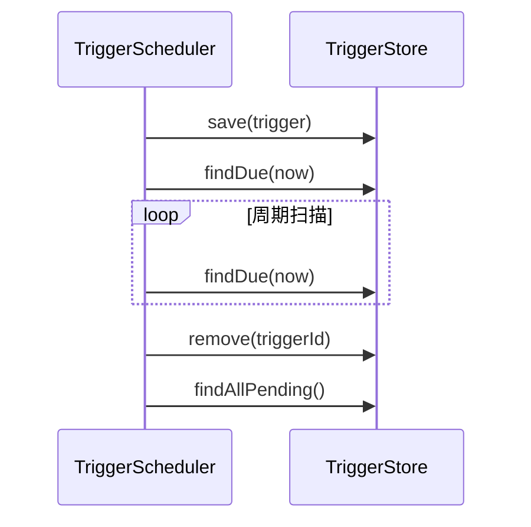

# Trigger Store 开发设计文档

<div v-pre>

## 1. 概述

`TriggerStore` 是 Tinyflow AI 工作流引擎中负责**持久化与查询 `Trigger`（调度任务）** 的核心存储抽象。它为 `TriggerScheduler` 提供了**任务持久化、到期查询、故障恢复**的能力，是实现**高可靠、可恢复、分布式**工作流调度的关键基础设施。

本文档详细阐述 `TriggerStore` 的**接口契约、典型实现、扩展模型与最佳实践**，帮助开发者构建高性能、高可用的调度存储层。


## 2. 接口设计

### 2.1 核心接口定义

```java
public interface TriggerStore {
    /**
     * 保存 Trigger（创建或更新）
     * @param trigger 要保存的 Trigger
     * @return 保存后的 Trigger（可能填充了 ID）
     */
    Trigger save(Trigger trigger);

    /**
     * 删除 Trigger
     * @param triggerId Trigger ID
     * @return true 表示成功删除
     */
    boolean remove(String triggerId);

    /**
     * 根据 ID 查询 Trigger
     * @param triggerId Trigger ID
     * @return Trigger 实例，不存在返回 null
     */
    Trigger find(String triggerId);

    /**
     * 查询所有到期的 Trigger（triggerAt <= uptoTimestamp）
     * @param uptoTimestamp 截止时间戳（毫秒）
     * @return 到期 Trigger 列表
     */
    List<Trigger> findDue(long uptoTimestamp);

    /**
     * 查询所有未完成的 Trigger（用于启动恢复）
     * @return 所有 Pending Trigger 列表
     */
    List<Trigger> findAllPending();
}
```

### 2.2 设计原则

- **持久化语义**：`save()` 必须保证数据持久化（非仅内存）
- **幂等性**：`save()` 多次调用应保证一致性
- **无异常契约**：接口方法不应抛出检查异常
- **线程安全**：实现需保证多线程并发访问安全

> ⚠️ **注意**：`findDue()` **必须高效**，因被周期扫描高频调用


## 3. 默认实现：`InMemoryTriggerStore`

### 3.1 实现机制

```java
public class InMemoryTriggerStore implements TriggerStore {
    private final ConcurrentHashMap<String, Trigger> store = new ConcurrentHashMap<>();

    @Override
    public Trigger save(Trigger trigger) {
        if (trigger.getId() == null) {
            trigger.setId(UUID.randomUUID().toString());
        }
        store.put(trigger.getId(), trigger);
        return trigger;
    }

    @Override
    public boolean remove(String triggerId) {
        return store.remove(triggerId) != null;
    }

    @Override
    public Trigger find(String triggerId) {
        return store.get(triggerId);
    }

    @Override
    public List<Trigger> findDue(long uptoTimestamp) {
        return null; // 未实现
    }

    @Override
    public List<Trigger> findAllPending() {
        return new ArrayList<>(store.values());
    }
}
```


> ⚠️ **InMemoryTriggerStore 不建议用于生产环境**，因：
> 1. 无持久化 → 重启会导致任务丢失
> 2. `findDue` 返回 `null` → 无周期补偿
> 3. 无 TTL → 高并发下有内存泄漏风险


## 4. 扩展模型

### 4.1 自定义存储实现

开发者可通过实现 `TriggerStore` 接口集成任意存储系统：

#### 关键实现要点：

1. **`findDue` 高效实现**
   ```java
   // 伪代码：使用 SortedSet（Redis ZSET）
   @Override
   public List<Trigger> findDue(long uptoTimestamp) {
       return redis.zrangeByScore("triggers:due", 0, uptoTimestamp);
   }
   ```

2. **原子性保障**
  - `save()` + `remove()` 需保证原子性
  - 分布式场景需实现**抢占锁**（如 lease 机制）

3. **TTL 策略**
  - 为 `Trigger` 设置过期时间（如 7 天）
  - 避免历史任务堆积

### 4.2 推荐存储方案

| 存储类型 | 适用场景 | 实现建议 |
|-|-|-|
| **Redis** | 分布式、高并发、短期任务 | ZSET（`triggerAt` 为 score） + Hash（详情） |
| **MySQL/PostgreSQL** | 强一致性、长期任务 | `trigger_at` 索引 + `status` 字段 |
| **MongoDB** | 文档友好、灵活查询 | TTL 索引 + 复合索引 |
| **RocksDB/LevelDB** | 单机持久化、高性能 | 自定义 key（`triggerAt:triggerId`） |


## 5. 核心方法详解

### 5.1 `save(Trigger)`

- **语义**：创建或更新（UPSERT）
- **ID 生成**：若 `trigger.getId() == null`，应生成唯一 ID
- **持久化**：必须写入持久化存储（非仅缓存）

### 5.2 `findDue(long uptoTimestamp)`

- **关键方法**：被 `TriggerScheduler` 周期扫描调用
- **性能要求**：O(log N) 或更好
- **推荐索引**：
  - **Redis**：ZSET（score = `triggerAt`）
  - **SQL**：`INDEX(trigger_at, status)`
  - **MongoDB**：`{ triggerAt: 1, status: 1 }`

### 5.3 `findAllPending()`

- **用途**：`TriggerScheduler` 启动时恢复未执行任务
- **语义**：返回所有未完成的 `Trigger`（无论是否到期）
- **优化**：可分页加载（避免 OOM）

### 5.4 `remove(String triggerId)`

- **触发时机**：
  - 任务成功执行后
  - 任务被取消（`TriggerScheduler.cancel()`）
  - 主动触发后（`TriggerScheduler.fire()`）
- **幂等性**：多次删除应返回 `false`（而非异常）


## 6. 分布式部署关键设计

### 6.1 抢占式锁（Lease Mechanism）

为避免多实例重复执行，需在 `TriggerStore` 层实现抢占：

#### Redis 实现示例
```java
public boolean acquireLease(String triggerId, String ownerId, long leaseTimeMs) {
    String key = "trigger:lease:" + triggerId;
    String result = redis.set(key, ownerId, "NX", "PX", leaseTimeMs);
    return "OK".equals(result);
}

public List<Trigger> findDueWithLease(long uptoTimestamp, String ownerId) {
    List<Trigger> due = findDue(uptoTimestamp);
    return due.stream()
        .filter(t -> acquireLease(t.getId(), ownerId, 30_000))
        .collect(Collectors.toList());
}
```

#### 数据库实现示例
```sql
-- 抢占查询
UPDATE triggers 
SET owner = ?, lease_until = NOW() + INTERVAL 30 SECOND 
WHERE id IN (
    SELECT id FROM (
        SELECT id FROM triggers 
        WHERE trigger_at <= ? AND (owner IS NULL OR lease_until < NOW())
        LIMIT 100
    ) AS t
)
```

### 6.2 状态字段（可选）

为增强可靠性，可增加状态字段：

| 字段 | 说明                                     |
|-|----------------------------------------|
| `status` | `PENDING` / `PROCESSING` / `COMPLETED` |
| `owner` | 当前处理节点 ID                              |
| `lease_until` | 租约过期时间                                 |
| `retry_count` | 重试次数（用于死任务检测）                          |


## 7. 自定义实现示例（Redis）

```java
public class RedisTriggerStore implements TriggerStore {
    private final RedissonClient redisson;
    private static final String TRIGGERS_ZSET = "triggers:due";
    private static final String TRIGGER_PREFIX = "trigger:";

    @Override
    public Trigger save(Trigger trigger) {
        if (trigger.getId() == null) {
            trigger.setId(UUID.randomUUID().toString());
        }
        
        // 保存详情
        String key = TRIGGER_PREFIX + trigger.getId();
        redisson.getBucket(key).set(trigger);
        
        // 加入到期集合（score = triggerAt）
        redisson.getScoredSortedSet(TRIGGERS_ZSET)
            .add(trigger.getTriggerAt(), trigger.getId());
        
        // 设置 TTL（7 天）
        redisson.getKeys().expire(key, 7, TimeUnit.DAYS);
        return trigger;
    }

    @Override
    public List<Trigger> findDue(long uptoTimestamp) {
        RScoredSortedSet<String> zset = redisson.getScoredSortedSet(TRIGGERS_ZSET);
        
        // 获取所有 triggerAt <= uptoTimestamp 的 ID
        Collection<String> ids = zset.valueRange(0, true, uptoTimestamp, true);
        
        // 批量获取详情
        List<Trigger> triggers = new ArrayList<>();
        RBatch batch = redisson.createBatch();
        for (String id : ids) {
            batch.getBucket(TRIGGER_PREFIX + id).getAsync();
        }
        List<?> responses = batch.execute().getResponses();
        for (Object resp : responses) {
            if (resp instanceof Trigger) {
                triggers.add((Trigger) resp);
            }
        }
        return triggers;
    }

    @Override
    public boolean remove(String triggerId) {
        String key = TRIGGER_PREFIX + triggerId;
        redisson.getKeys().delete(key);
        redisson.getScoredSortedSet(TRIGGERS_ZSET).remove(triggerId);
        return true;
    }

    // ... other methods
}
```


## 8. 最佳实践

### 8.1 性能优化

- **`findDue` 索引**：确保 `triggerAt` 有高效索引
- **批量操作**：`findAllPending()` 分页加载
- **缓存层**：高频访问的 `Trigger` 可加本地缓存（需处理一致性）

### 8.2 可靠性保障

- **TTL 策略**：自动清理过期 `Trigger`（如 7 天）
- **死任务检测**：`lease_until` 过期的任务应重新释放

### 8.3 安全与合规

- **输入校验**：对 `triggerId` 进行白名单校验
- **敏感数据脱敏**：`payload` 中避免存储密钥
- **访问控制**：多租户场景下隔离 `Trigger`

### 8.4 资源管理

- **内存控制**：`InMemoryTriggerStore` 仅用于测试
- **连接池**：数据库/Redis 使用连接池
- **优雅关闭**：应用退出时释放资源


## 9. 与 TriggerScheduler 的集成

### 9.1 调用时序



### 9.2 关键交互点

- **启动恢复**：`findAllPending()` → 重新调度所有任务
- **周期补偿**：`findDue(now)` → 执行漏调度任务
- **任务清理**：执行成功后 `remove(triggerId)`


## 10. 总结

`TriggerStore` 是 Tinyflow 调度引擎的**持久化基石**。开发者应根据业务场景选择合适的存储方案，并重点优化到期任务查询性能，为 AI 工作流提供坚实的基础支持。


</div>
