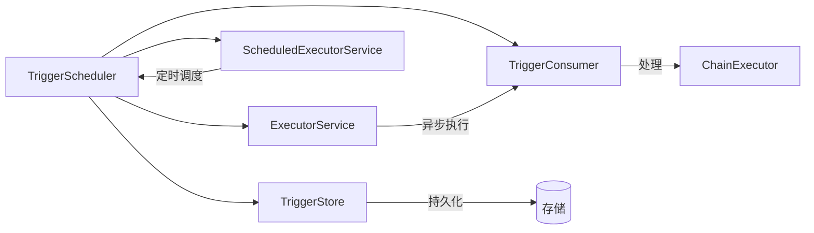
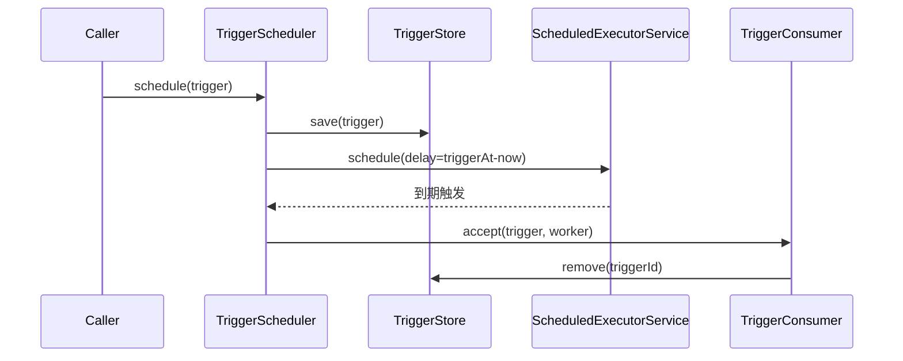
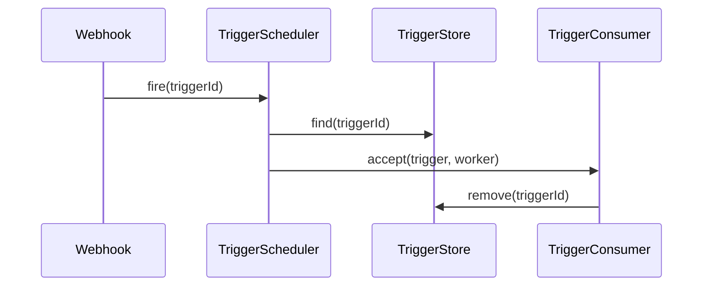

# Trigger 开发设计文档

<div v-pre>

## 1. 概述

`Trigger` 是 Tinyflow AI 工作流引擎中的**调度单元**，代表一个待执行的工作单元（节点或整个链）。`TriggerScheduler` 负责 `Trigger` 的**持久化、延迟调度、周期扫描与故障恢复**，是实现**可靠、分布式、可恢复**工作流执行的核心基础设施。

本文档深入解析 `Trigger` 的**数据模型、调度机制、容错设计与扩展能力**，帮助开发者构建高可用的工作流调度系统。


## 2. 核心设计原则

### 2.1 调度与执行解耦

- **`Trigger`**：纯数据载体，描述“**何时、何地、如何**”执行
- **`TriggerScheduler`**：调度器，负责时间管理与持久化
- **`TriggerConsumer`**：执行器（如 `ChainExecutor`），负责实际业务逻辑

> **特点**：调度层与执行层可独立扩展

### 2.2 持久化优先（Persistence-First）

- 所有 `Trigger` 先持久化到 `TriggerStore`，再调度
- 保证**宕机不丢任务**
- 支持**跨进程/跨机器**恢复

### 2.3 分布式安全

- `TriggerStore` 层需实现**抢占式锁**（如 lease 机制）
- `TriggerScheduler` 本身为**单机语义**，分布式需外部协调

### 2.4 多触发类型支持

通过 `TriggerType` 支持丰富场景：
- `NEXT`：普通节点调度
- `RETRY`：失败重试
- `LOOP`：循环执行
- `TIMER`/`CRON`：定时任务
- `MANUAL`/`EVENT`：人工/事件触发


## 3. Trigger 数据模型

### 3.1 核心字段

| 字段 | 类型 | 说明                          |
|-|-|-----------------------------|
| `id` | `String` | 唯一标识（UUID 自动生成）             |
| `stateInstanceId` | `String` | 关联的 `ChainState` 实例 ID      |
| `parentInstanceId` | `String` | 父工作流实例 ID（用于子流程）            |
| `nodeId` | `String` | **目标节点 ID**（`null` 表示触发整个链） |
| `edgeId` | `String` | 触发边 ID（用于条件分支）              |
| `type` | `TriggerType` | 触发类型（重试/循环/定时等）             |
| `triggerAt` | `long` | **触发时间戳**（epoch ms）         |
| `payload` | `Map<String, Object>` | 附加数据（如用户输入）                 |

### 3.2 关键设计

- **`nodeId` 可空**：支持两种调度粒度
  - 节点级：`nodeId != null`（最常见）
  - 链级：`nodeId == null`（用于启动新链）
- **`payload` 机制**：传递运行时数据（如 `resume` 时的用户输入）
- **`parentInstanceId`**：支持嵌套工作流（子流程上下文传递）


## 4. TriggerScheduler 调度机制

### 4.1 架构组件



| 组件 | 职责    | 可配置 |
|-|-------|--|
| `TriggerStore` | 持久化存储 | ✅ |
| `ScheduledExecutorService` | 延迟调度  | ✅ |
| `ExecutorService` | 异步执行  | ✅ |
| `TriggerConsumer` | 业务处理  | ✅ |

### 4.2 调度流程

#### 正常调度（`schedule`）


#### 主动触发（`fire`）



## 5. 容错与恢复机制

### 5.1 启动恢复（`recoverAndSchedulePending`）

- **时机**：`TriggerScheduler` 初始化时
- **操作**：加载所有未执行的 `Trigger` 并重新调度
- **保证**：JVM 重启后任务不丢失

### 5.2 周期补偿扫描（`startPeriodicScan`）

- **机制**：每 `scanIntervalMs`（默认 5s）扫描 `store.findDue(upto=now)`
- **目的**：处理以下场景：
  - 调度器宕机期间到期的任务
  - `ScheduledExecutorService` 丢失的任务
  - 分布式环境下其他节点释放的任务
- **去重**：跳过已在 `scheduledFutures` 中的任务

> 🔁 **双重保障**：内存调度 + 周期扫描，确保高可靠

### 5.3 执行上下文（`TriggerContext`）

```java
public class TriggerContext {
    private static final ThreadLocal<Trigger> currentTrigger = new ThreadLocal<>();
}
```

- **用途**：在 `TriggerConsumer` 执行线程中获取当前 `Trigger`
- **典型场景**：
  - 日志打标（`MDC.put("triggerId", trigger.getId())`）
  - 权限校验（`trigger.getPayload().get("userId")`）


## 6. 分布式部署指南

### 6.1 单机模式

- 默认行为，适用于单实例部署
- `TriggerStore` 可使用内存/本地文件

### 6.2 分布式模式

- **要求**：`TriggerStore` 必须支持**分布式抢占锁**
- **推荐实现**：
  - **Redis**：`SET trigger:{id} {data} NX PX {leaseTime}`
  - **数据库**：`UPDATE triggers SET owner = ?, lease_until = ? WHERE id = ? AND (owner IS NULL OR lease_until < NOW())`
- **调度器部署**：
  - 多实例部署 `TriggerScheduler`
  - 共享同一个 `TriggerStore`
  - 通过抢占锁避免重复执行

### 6.3 高可用保障

| 机制 | 说明                         |
|--|----------------------------|
| **持久化** | 任务不因调度器宕机丢失                |
| **抢占锁** | 避免多实例重复执行                  |
| **周期扫描** | 补偿漏调度任务                    |
| **执行幂等** | `Chain.executeNode` 本身需幂等  |


## 7. 扩展与定制

### 7.1 自定义 TriggerStore

```java
public class RedisTriggerStore implements TriggerStore {
    private final RedissonClient redisson;
    
    @Override
    public void save(Trigger trigger) {
        RMap<String, Trigger> map = redisson.getMap("triggers");
        map.put(trigger.getId(), trigger);
        // 设置 TTL 避免永久堆积
        redisson.getKeys().expire("trigger:" + trigger.getId(), 7, TimeUnit.DAYS);
    }
    
    @Override
    public List<Trigger> findDue(long upto) {
        // 扫描所有 trigger，过滤 triggerAt <= upto
        // 实际生产建议用 SortedSet 实现
    }
}
```

### 7.2 自定义执行器（TriggerConsumer）

```java
// ChainExecutor 中的 accept 方法
public void accept(Trigger trigger, ExecutorService worker) {
    // 1. 重建 Chain 上下文
    Chain chain = rebuildChain(trigger.getStateInstanceId());
    // 2. 合并 payload 到 memory
    if (trigger.getPayload() != null) {
        chain.updateStateSafely(s -> {
            s.getMemory().putAll(trigger.getPayload());
            return EnumSet.of(ChainStateField.MEMORY);
        });
    }
    // 3. 执行节点
    Node node = chain.getDefinition().getNodeById(trigger.getNodeId());
    chain.executeNode(node, trigger.getEdgeId());
}
```

### 7.3 监控与指标

建议在 `TriggerConsumer` 中埋点：
```java
public void accept(Trigger trigger, ExecutorService worker) {
    Timer.Sample sample = Timer.start();
    try {
        // 执行逻辑
    } finally {
        sample.stop(
            Timer.builder("trigger.execution")
                .tag("type", trigger.getType().name())
                .tag("node", trigger.getNodeId())
                .register(Metrics.globalRegistry)
        );
    }
}
```


## 8. 最佳实践

✅ **存储选型**：
- **开发测试**：`InMemoryTriggerStore`
- **生产单机**：本地 LevelDB/RocksDB
- **生产分布式**：Redis（带 TTL）或 MySQL（带抢占锁）

✅ **调度参数**：
- `scanIntervalMs`：根据任务密度调整（1s~30s）
- `ScheduledExecutorService`：线程数 = CPU 核数
- `ExecutorService`：使用带队列的固定线程池

✅ **错误处理**：
- `TriggerConsumer` 需捕获所有异常（避免线程崩溃）
- 失败任务应记录日志并告警（而非静默丢弃）

✅ **资源清理**：
- 为 `Trigger` 设置 TTL（如 7 天）
- 定期归档历史 `Trigger`


## 9. 性能与可靠性

| 机制 | 说明                               |
|--|----------------------------------|
| **内存调度** | `ScheduledExecutorService` 高精度延迟 |
| **持久化保障** | 先存后调度，避免任务丢失                     |
| **双重扫描** | 内存 + 周期扫描，补偿漏调度                  |
| **执行隔离** | 调度线程 vs 工作线程，避免阻塞                |
| **上下文传递** | `ThreadLocal` 保证执行上下文            |


## 10. 总结

`Trigger` 与 `TriggerScheduler` 构成了 Tinyflow 工作流引擎的**调度基石**，通过持久化、双重保障、分布式安全等设计，为 AI 工作流提供了**高可靠、可扩展、可恢复**的执行能力。开发者可基于其构建从简单定时任务到复杂分布式工作流的各类应用场景。


</div>
